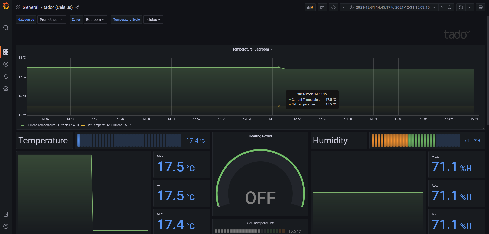

# Simple Grafana dashboard for tado°

The dashboard displays information collected from your [tado°](https://www.tado.com/)
devices. It uses a Prometheus exporter to retrieve data from the service and
export it to Prometheus, and Grafana to present the information through a simple
interface. The underlying services run on Docker containers so, aside from a
tado° account, no other configuration is required.

## Requirements

- Docker
- tado° (required to show real data)

## Configuration

1. Replace login details for tado° in the [.env](./.env) file with your own
1. Start the containers with `docker-compose up -d`
1. Visit the link below and open the included Grafana dashboard

http://localhost:3000/dashboards

Note: _the fetch interval for tado° can be modified by changing the value of the env var within the same file, but I doubt a shorter interval will be needed._ 

## Credits

- [eko/tado-exporter](https://github.com/eko/tado-exporter)
- [disisto/grafana-dashboard-for-prometheus-tado-exporter](https://github.com/disisto/grafana-dashboard-for-prometheus-tado-exporter)

## License

[MIT License](./LICENSE.md)

Copyright &copy; 2021 Stefano Frazzetto

All other trademarks and copyrights are property of their respective owners.
